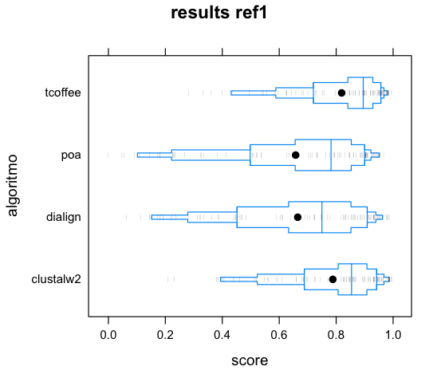
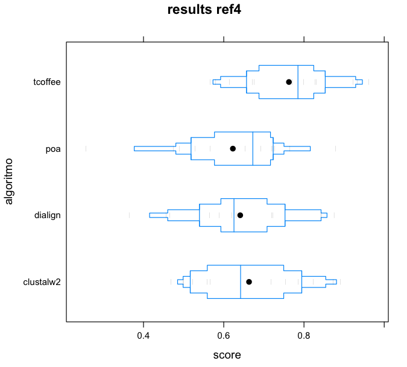
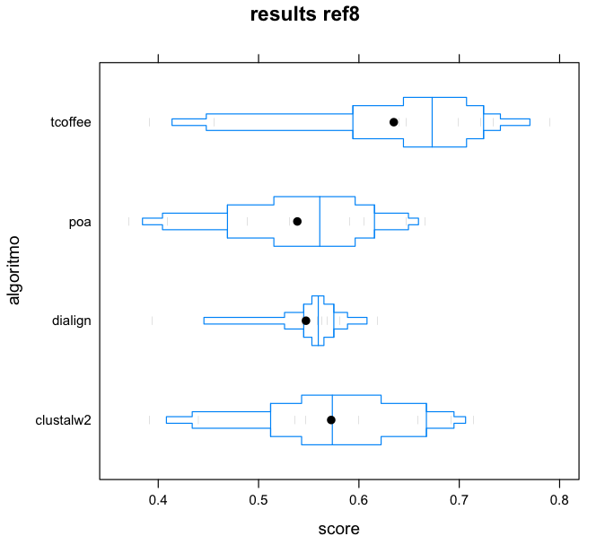
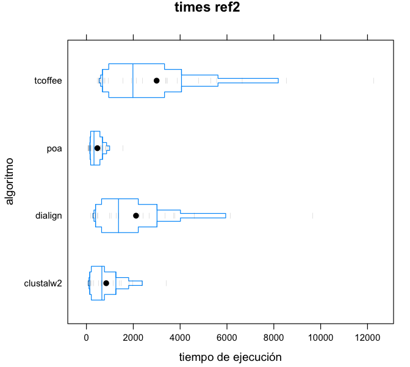
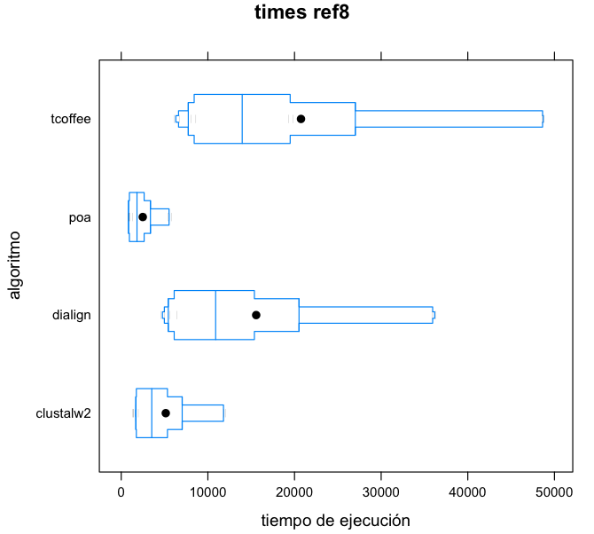

\centerline{\huge \bfseries Bioinformática I}
\centerline{Guillermo Winkler}
\centerline{guillermo.winkler@gmail.com}
\centerline{2588122-1}

\newpage

Problema 1, alineamiento de secuencias
================================

Resumen
-------------
Para el problema 1 se desarrolló un programa en Pyhton que realiza alineamiento de hasta dos secuencias utilizando el algoritmo Needleman-Wunsch.

Se optó por realizar la tarea opcional de considerar costos de apertura de gaps utilizando affine gaps, donde se utilizan
dos matrices auxiliares para poder considerar por separado el costo de la apertura de un nuevo gap, versus el costo
de dejar un gap abierto si ya lo tenía en esas condiciones.

Como output del programa se obtiene el mejor score encontrado y un árbol con todos los alineamientos posibles.

Programa
------------

El programa Python se encuentra dentro del directorio `project` del entregable y está contenido dentro del archivo
align.py. Puede a su vez encontrarse publicado online [en github][gh py].

Entrada
----------

Como entrada el programa espera dos archivos, uno con las secuencias a alinear en formato fasta y otro con
la matriz de costos de alineamiento.

Si bien los nombres de los archivos están fijos en el código, modificar el programa para recibirlos por parámetro es trivial.

~~~~~~~~~~~~~~~~
def main():
    sequences = read_sequences('sequences.fasta')
    score_matrix = read_matrix('blosum.txt')
    sequence_a = sequences[0]
    sequence_b = sequences[1]
    result = needleman_wunsch(sequence_a, sequence_b, score_matrix)
...
~~~~~~~~~~~~~~~~

La matriz blosum.txt que se adjunta es un diccionario Python donde la clave de cada entrada es el par de nucleótidos y el valor 
es el costo asociado a dicho par.

~~~~~~~~~~~~~~~~
{
('W', 'F') : 1, ('L', 'R') : -2, ('S', 'P') : -1, ('V', 'T') : 0,
('Q', 'Q') : 5, ('N', 'A') : -2, ('Z', 'Y') : -2, ('W', 'R') : -3,
('Q', 'A') : -1, ('S', 'D') : 0, ('H', 'H') : 8, ('S', 'H') : -1,
('H', 'D') : -1, ('L', 'N') : -3, ('W', 'A') : -3, ('Y', 'M') : -1,
….
~~~~~~~~~~~~~~~~

El archivo fasta es estándar, le lectura del mismo se realizó desde cero sin utilizar la librería SeqIO. En caso que haya mas de dos secuencias en el mismo se utilizarán las dos primeras.

~~~~~~~~~~~~~~~~
>Seq1
ARYL
>Seq2
AARYL
~~~~~~~~~~~~~~~~

Estrategia de Solución
----------------------------

Para resolver el problema se utilizó el algoritmo clásico con las siguientes particularidades:

**1 Matriz de caminos**

Para poder devolver la lista de caminos de costo óptimo(puede haber más de uno), a medida que se calculan los scores se debe ir marcando las celdas origen de como se obtiene dicho mejor score.

Esto se resolvió utilizando una matriz auxiliar donde en cada celda se guardan los valores de las "flechas" codificados en potencias de 2.

Como en cada celda puedo tener 3 valores posibles que se pueden dar en simultáneo - deletion, insertion y match - se codificaron los valores de la siguiente forma:

~~~~~~~~~~~~~~~~
#definitions for building paths
MATCH_PATH=2
INSERT_PATH=4
DELETE_PATH=8
~~~~~~~~~~~~~~~~

De esta manera, si una celda de la matriz auxiliar contiene el valor 6, se sabe que se llega por match y por insert. Un resultado de ejemplo de dicha matriz es el siguiente:

~~~~~~~~~~~~~~~~
Paths Matrix:
[[ nan  nan  nan  nan  nan  nan]
 [ nan   2.   6.   4.   4.   4.]
 [ nan   8.   2.   2.   4.   4.]
 [ nan   8.   8.   8.   2.   4.]
 [ nan   8.  10.   8.   8.   2.]]
~~~~~~~~~~~~~~~~

**2 Armado de caminos**

Junto con la matriz anterior, y la matriz de resultados de alineamiento:

~~~~~~~~~~~~~~~~
Alignment Matrix:
[[  0.  -3.  -4.  -5.  -6.  -7.]
 [ -3.   4.   1.   0.  -1.  -2.]
 [ -4.   1.   3.   6.   3.   2.]
 [ -5.   0.   0.   3.  13.  10.]
 [ -6.  -1.  -1.   2.  10.  17.]]
~~~~~~~~~~~~~~~~

Se debe armar el conjunto de mejores caminos que dan el conjunto de alineaciones con el score óptimo.

Para esto se definió una estructura auxiliar del tipo árbol, que permite modelar los distintos caminos en una única estructura de datos, dicho árbol esta definido de la siguiente forma:

~~~~~~~~~~~~~~~~
{ 'match'  : None,
  'insert' : None,
  'delete' : None,
  'val-a'  : None,
  'val-b'  : None }
~~~~~~~~~~~~~~~~

Donde match, insert y delete son nodos hijos del árbol y val-a y val-b son los dos valores del alineamiento para cada secuencia del par. Esto permite armar un árbol inverso donde la raíz del árbol es la última celda 
del alineamiento global y los hijos del nodo son las celdas desde donde se llegó al mejor camino.

**3 Visualización**

Para la visualización de los caminos se desarrollo un algoritmo recursivo para imprimir el árbol, donde se ven las distintas alternativas de alineamiento, como se observa en la siguiente salida del programa:

~~~~~~~~~~~~~~~~
Sequences possible alignments tree:
   * 
     = L/L
         = Y/Y
             = R/R
               | = A/A
               |     + -/A
                 + -/A
                     = A/A
~~~~~~~~~~~~~~~~

Cada nodo del árbol despliega la pareja de nucleótidos para cada secuencia y un código para indicar si fue match (=) insert(+) o delete(-). En el caso anterior donde se alinearon las secuencias ARYL y AARYL el árbol muestra claramente que se puede realizar el insert de la nueva A tanto en a primera como en la segunda posición obteniendo el mismo costo final.

Adjuntos
----------

Los archivos relevantes para este informe son los siguientes

* *needleman_wunsch/align.py*: Código fuente del alineamiento
* *needleman_wunsch/blosum.txt*: Matriz blosum62 utilizada 
* *needleman_wunsch/sequences.fasta*: Archivo de secuencias de ejemplo para la ejecución

Problema 2, comparación de algoritmos de MSA
=====================================

Resumen
-------------
Para el problema 2, se desarrolló un script en lenguaje Clojure que recorra todas las secuencias de BaliBase2 y para cada una ejecute los algoritmos seleccionados.

Luego, con los alineamientos obtenidos, se obtuvo un score de comparación contra los alineamientos de referencia utilizando el programa bali_base, provisto también 
dentro de la base de alineamientos de referencia.

Con los scores obtenidos, se generó un archivo `csv` que se importó en `R` para su análisis, donde se confirmó que los mejores resultados son obtenidos con el algoritmo
T-Coffee, que es a su vez el de mayor costo computacional.

Se detectaron varios problemas inclusive en los datos publicados en el benchmark que se detallan en el informe.

Algoritmos seleccionados
------------
La mayoría de los algoritmos utilizados para alineamiento múltiple se basan en una heurística de búsqueda conocida como `progresiva`, que construye un alineamiento final combinando 
alineamientos de a pares comenzando con el par mas similar y progresando hacia los mas alejados.

Todos los alineamientos progresivos requieren de dos etapas, una primera etapa en donde las relaciones entre las secuencias se representan como un árbol, conocido como el `árbol guía`, y un
segundo paso en donde el alineamiento es generado agregando las secuencias al alineamiento según el árbol guía. El árbol guía inicial es determinado utilizando un método eficiente de clustering
como neighbor-joining o UPGMA, y puede usar distancias basadas en el número de sub-secuencias de dos letras idénticas.

El otro conjunto de métodos que producen alineamientos múltiples reduciendo los errores inherentes al proceso de alineamiento progresivo son los clasificados como `iterativos`, estos funcionan
de forma similar a los progresivos, pero de forma repetida vuelven a alinear las secuencias iniciales al tiempo que agregan nuevas secuencias al alineamiento multiple que va creciendo.

Uno de los problemas de los alineamientos progresivos es que son fuertemente dependientes en el alineamiento inicial, ya que una vez que dichas secuencias son incorporadas nunca vuelven 
a considerarse nuevamente. En contraste, los métodos iterativos pueden volver a alineamientos de a pares calculados previamente.

**ClustalW2**

De los más populares de la familia de alineamientos progresivos, se utilizó la versión `weighted`, donde pesos individuales se le asignan a cada secuencia en un
alineamiento parcial de forma tal de bajarle el peso a las secuencias casi duplicadas y subirles el peso a las más divergentes.
Luego las matrices de substitución de aminoácidos son cambiadas en las diferentes etapas de acuerdo a la divergencia de las secuencias siendo alineadas. [14]

El programa fue bajado [del siguiente sitio de clustal][clustalw2].

**Dialign**

Dialign es uno de los algoritmos iterativos.

Este algoritmo toma un encare inusual de enfocarse en alineamientos locales entre sub-segmentos o secuencias de motivos sin introducir penalización por gaps. [15]
El alineamiento de motivos individuales es entonces obtenido con una representación matricial similar a una dot-matrix en un alineamiento de a pares.

El programa fue bajado [del siguiente sitio de dialign][dialign].

**Poa**

POA (Partial Order alignment) es un método que utiliza HMM (Hidden Markov Models) como modelo probabilistico para asignar probabilidades a todas las posibles
combinaciones de gaps, matches y mismatches para determinar el alineamiento múltiple más probable.

Los modelos basados en HMM ofrecen una ventaja significante en costo computacional especialmente en secuencias que tienen regiones superpuestas. [16]

El programa fue bajado [del siguiente sitio de poa][poa].

**T-Coffee**

Es otro alineamiento progresivo bastante común, mas lento que Clustal y sus derivados pero que generalmente produce alineamientos más exactos para secuencias distantes.

T-Coffee utiliza la salida de Clustal y la de otro programa de alineamiento local llamado LALIGN, que encuentra múltiples regiones de alineamiento local entre dos secuencias.
El alineamiento resultante y árbol filogenético son usados como guía para producir factores de peso mas exactos.

El programa fue bajado [del siguiente sitio de tcoffee][tcoffee].

Estrategia
-------------

Para resolver el problema se desarrolló un script en el lenguaje Clojure con el propósito de ejecutar los distintos algoritmos contra las diferentes secuencias.
El script se puede encontrar en el directorio `multiple_seq_aligner` del entregable y también fue publicado de forma abierta [en github][gh clj].

El script itera por todos los archivos `fasta` disponibles en BaliBase2 

~~~~~~~~~~~~~~~~
(defn fasta-map 
  []
  (println "Building fasta map")
  (let [path (str balibase "/fastas")
        file-list (find-files path "*")
        fastas (filter #(re-find #"\.india|\.tfa" %) file-list)]
    (reduce (fn [hm f] 
              (let [key (re-find #"^[^.]+" f)]
                (assoc hm key (str path "/" f)))) {} fastas)))
~~~~~~~~~~~~~~~~

Y ejecuta para cada uno el alineamiento de las secuencias contenidas.

~~~~~~~~~~~~~~~~
(defn align-sequences
  [fastas algorithm]
  (reduce (fn [hm a] 
            (let [key (get a 0) 
                  file-name (clojure.string/replace key #"/" "_")
                  start-time (System/nanoTime)
                  msf-file (algorithm (get a 1) file-name output-dir)
                  stop-time (System/nanoTime)
                  response {:msf-file msf-file
                            :time (- stop-time start-time)}]
              (assoc hm key response))) {} fastas))
~~~~~~~~~~~~~~~~

Dicha función utiliza funciones de primer orden recibiendo por parámetro la función con el algoritmo a ejecutar, cada algoritmo genera un archivo en formato `msf` con el resultado 
y guarda también el tiempo de ejecución del mismo.

Cada programa se define en una función diferente donde se configura según las particularidades de ejecución del mismo

~~~~~~~~~~~~~~~~
(defn dialign
  [sequence-file file-name output-dir]
  (println "Building dialign alignments...")
  (let [program (str dialign-path "/src/dialign2-2")
        data-dir (str dialign-path "/dialign2_dir")
        aligner (format "%s -fn ./%s/%s_dialign -msf %s" 
                                    program output-dir file-name sequence-file)
        command (format "export DIALIGN2_DIR=%s;%s" data-dir aligner)
        response (exec-script (command))]
    (when (= "" (:out response))
      (format "%s/%s_dialign.ms" output-dir file-name))))
~~~~~~~~~~~~~~~~

En el caso anterior de dialign por ejemplo el programa necesita tener disponible la variable de entorno DIALIGN2_DIR con el path a donde están ubicadas las matrices blosum y demás.

El único caso particular de los programas utilizados es el de `POA` cuyo output no puede ser realizado en formato `msf` que es el requerido por el programa de scoring `bali score` por lo que
se convierte el resultado en formato `clustal` a formato `msf` antes de retornar.

Como salida genera un archivo `csv` con los distintos escores de bali score y tiempos de ejecución para cada archivo fasta analizado:

~~~~~~~~~~~~~~~~
"referid","testid","seqid","algorithm","sp","tc","time"
"ref8","test","ptga_2_ref8","tcoffee","0.790","0.576","19307.953"
"ref8","test","ptga_2_ref8","dialign","0.558","0.214","15398.157"
"ref8","test","ptga_2_ref8","poa","0.489","0.192","2658.893"
"ref8","test","ptga_2_ref8","clustalw2","0.547","0.206","5446.718"
"ref1","test2","1ppn_ref1","tcoffee","0.983","0.971","295.784"
"ref1","test2","1ppn_ref1","dialign","0.908","0.850","144.743"
"ref1","test2","1ppn_ref1","poa","0.949","0.913","122.061"
"ref1","test2","1ppn_ref1","clustalw2","0.987","0.976","130.485"
"ref1","test3","1lcf_ref1","tcoffee","0.970","0.937","1583.284"
"ref1","test3","1lcf_ref1","dialign","0.916","0.830","1153.834"
"ref1","test3","1lcf_ref1","poa","0.922","0.839","388.75"
"ref1","test3","1lcf_ref1","clustalw2","0.948","0.903","937.627"
"ref6","test_1a","dead_ref6","tcoffee","","","27024.809"
"ref6","test_1a","dead_ref6","dialign","","","15420.384"
"ref6","test_1a","dead_ref6","poa","","","2946.124"
~~~~~~~~~~~~~~~~

Las líneas que se encuentran vacías, por ejemplo `dead_ref6` son consecuencia de lo explicado en el punto 3 de la sección `Problemas encontrados`

Dicho archivo es utilizado en R para el análisis de los resultados.

Problemas encontrados
------------

**1. BaliBase1 no contiene las secuencias originales**

Si bien en la letra del obligatorio se sugiere utilizar BaliBase1 el archivo publicado de dicha base de datos no contiene las secuencias fasta originales, sino que solamente contiene
los alineamientos de referencia.

Si bien es posible reconstruir los fasta originales a partir de los alineamientos de referencia haciendo copy/paste con los alineamientos, al 
ser casi 300 fastas con multiples secuencias en cada uno implica o bien un proceso tedioso y propenso a errores o implica desarrollar
un nuevo script para hacer esta tarea.

En caso que se desee realizar esta tarea de "recomponer" secuencias se podría utilizar una estrategia similar a la de la función `readmsf` del
archivo bali_score.c.

**2. bali_score2 falla con segmentation fault por los largos de secuencia**

El programa bali_score, que varía para las diferentes versiones de BaliBase falla con un error de acceso a memoria leyendo los propios alineamientos de referencia de BaliBase2.

Por ejemplo la secuencia `O60072_2` en el archivo `/ref6/test_1a/dead_ref6.msf` es de largo 1423

~~~~~~~~~~~~~~~~
-------------------------------------------------------------------------------------------------
-----------------------------------------------------------------------------
------------------------------------------------------------------------------------------------
-------------------------------------------------------------------------------
------------------------------------------------------------------------------------------------
------------------------------------------LPITALHDP-VLEGICAK-R
FSFFNAVQTQFFHTIYHTDTNIFVGAPTGSGKTMAAELATWRALHNYP-----------------KSKVVYIAPMKALVKERVKDWGHRLVEPMG
ISMIELTG-DTNPDVKAVTNANIIITTPEKWDGITRSW-KSRKYVQDVSLIILDEIHLLGSD-RGPVLEMIVSRMNYVASQTNKKVRVLGLST
AVANANDLANWLNI--RDGLFNFRHSVRPVPLEIYIDGFPGR-AYCPRMMSMNKPAFQAIKTHS---PTQPVLIFVSSRRQTRLTAKDLIA
FCGLEDNPRRFLYM--DEEELE--MIVSEVEDKSLKLALPFGIALHHAGLTENDRKISEELFVNNKVQILIATSTLAWGVNTPAHLVIVKGT
EYYDAKIGGYKDMDLTDVLQMLGRAGRPQFDNS-GVARIFVQDIKKSFYKHFLHSGFPVESYLHKVLDNHLNAEIATGTIDCIQGAMDF
LTCTYFYRRVHQNPVYYGADGDDQKSIDTYLSKLVVTAFNELEKSACIYRVN----------------EETYAPTTLGRIVSYYYLFHTTIRNFVQKI
TENAEFDLALQLLAEASEFDDLAIRHNEDLINIEINKSLKYSAAC-----LNLPMVDAHVKAFILTQAHMARLKLPVDDYVTDTSTVLDQVIR
IIQSYIDVSAELGYSHVCLQYISLMQCLKQACYPSEIYRASLPGLNASSEKEARD-----YLNKFAGNKTDELYQMLCNDPNVFDIESLVNS
LISYPKMNI-------------------EVSQSSSDKLLLY---LRRLNQPLNP-------------DFYIFAPLFPKPQ-SEGFFVLIIDSETQELFAIRRASFAGRR
NDDSIRLSLRISMDIPPTCRNRNVKVMVVCDGYPLIYEHKIVLMI-------------------
~~~~~~~~~~~~~~~~

Mientras que bali_score2.c tiene definido como largo máximo solamente 1000:

~~~~~~~~~~~~~~~~
#define MAXLEN 1000
~~~~~~~~~~~~~~~~

Esto da origen a problemas de stack overflow y corrupción de memoria cuando se ejecuta la comparación, ya que en la función `readmsf` donde se
"rearman" las secuencias el vector `seq` está inicializado en `MAXLEN+1`, y `seq[len++]` escribe por sobre la memoria reservada en el stack.

~~~~~~~~~~~~~~~~
void readmsf(FILE *fin) {
static char line[MAXLINE+1];
char seq[MAXLEN+1];
...
for(i=k;i<=MAXLINE;i++) {
	c=line[i];                                                                                                                                      
	if(c == '.' || c == '~' ) c = '-';
	if(c == '*') c = 'X';
	if(c == '\n' || c == EOS) break; /* EOL */
	if(isalpha(c) || c=='-') seq[len++]=c;
}
..
~~~~~~~~~~~~~~~~

Esto fue solucionado como forma de asegurar que se estaba usando el mismo programa de scoring que la base de referencia.

**3. En BaliBase2 los alineamientos de referencia contienen diferentes secuencia que los fasta publicados**

Para muchos archivos fasta proporcionados en BaliBase2 las secuencias contenidas en el mismo, no coinciden con las secuencias publicadas en los alineamientos de referencia.
Un caso concreto es el del archivo `/ref6/test_1a/dead_ref6.tfa`donde contiene las 7 secuencias

>BRR2_YEAST
>O48534
>Q9SYP1
>O75643
>Q9U2G0
>P53327
>O60072

Mientras que los aineamientos de referencia en `/ref6/test_1a/dead_ref6.msf` son 14:

~~~~~~~~~~~~~~~~
MSF: 1423  Type: P    Check:   550   ..
  6 
  7  Name: BRR2_YEAST_1 oo  Len: 1423  Check:  9406  Weight:  10.0
  8  Name: BRR2_YEAST_2 oo  Len: 1423  Check:  9692  Weight:  10.0
  9  Name: O48534_1 oo  Len: 1423  Check:  1636  Weight:  10.0
 10  Name: O48534_2 oo  Len: 1423  Check:  3868  Weight:  10.0
 11  Name: Q9SYP1_1 oo  Len: 1423  Check:  1355  Weight:  10.0
 12  Name: Q9SYP1_2 oo  Len: 1423  Check:  6080  Weight:  10.0
 13  Name: O75643_1 oo  Len: 1423  Check:  5352  Weight:  10.0
 14  Name: O75643_2 oo  Len: 1423  Check:  1730  Weight:  10.0
 15  Name: Q9U2G0_1 oo  Len: 1423  Check:  6280  Weight:  10.0
 16  Name: Q9U2G0_2 oo  Len: 1423  Check:  8006  Weight:  10.0
 17  Name: P53327_1 oo  Len: 1423  Check:  8389  Weight:  10.0
 18  Name: P53327_2 oo  Len: 1423  Check:  6971  Weight:  10.0
 19  Name: O60072_1 oo  Len: 1423  Check:  1785  Weight:  10.0
 20  Name: O60072_2 oo  Len: 1423  Check:     0  Weight:  10.0
~~~~~~~~~~~~~~~~

Lo que genera el siguiente error del bali_score al querer compararlos:

~~~~~~~~~~~~~~~~
Error: 14 sequences in /ref6/test_1a/dead_ref6.msf 
and 7 in ./results/ref6_test_1a_dead_ref6_clustalw2.msf
~~~~~~~~~~~~~~~~

Para el presente trabajo se corrigieron los errores en balibase2 y se generaron los resultados contra dichos alineamientos de referencia.

Análisis
-----------

Para el análisis de resultados se importo el archivo `csv` en `R` y para las distintos conjuntos jerárquicos de referencia provistos por BaliBase2, se analizó:

* La diferencia de scores según balibase2 para los distintos algoritmos
* El tiempo de ejecución de los distintos algoritmos en las distintas referencias

El script básico de análisis en `R` es el siguiente:

~~~~~~~~~~~~~~~~
scores <- read.csv("multiple_seq_aligner/results/scores.csv")
scores <- na.omit(scores)
ref1 <- subset(scores, scores$referid == "ref1")
bwplot(algorithm~sp, data=ref1, panel=panel.bpplot, datadensity=TRUE,
             ylab="algoritmo", xlab="score")
bwplot(algorithm~time, data=ref1, panel=panel.bpplot, datadensity=TRUE,
             ylab="algoritmo", xlab="tiempo de ejecución")
~~~~~~~~~~~~~~~~

Donde la función `bwplot` nos permite visualizar no solamente el promedio para cada resultado sino que la propia distribución de los mismos.

**Referencia 1**

La referencia 1 está compuesta por secuencias equidistantes con varios niveles de conservación.
Para este caso observamos que si bien los algoritmos de mayor costo computacional obtienen mejores resultados, todos performan relativamente bien.

\

**Referencia 4**

La referencia 4 está dividida en dos subcategorías conteniendo elementos de hasta 20 secuencias incluyendo extensiones N/C terminales de hasta
400 residuos, e inserciones hasta 100 residuos.

En este caso observamos como el score de alineamiento es menor que con secuencias equidistantes de la referencia 1.

\

**Referencia 8**

Los alineamientos de referencia número 8 se agregaron para la versión 2 de BaliBase y contiene dos problemas diferentes pero relacionados.
La referencia 8 contiene 5 familias de proteínas en donde el orden secuencial de los dominios no es preservado.

En este caso también observamos peores resultados.

\

**Tiempos de ejecución**

Dentro de lo esperado para los tiempos de ejecución los algoritmos T-Coffee y Dialign son consistentemente mas costosos que Poa y ClustalW.

Tiempos en referencia 2:

\

Tiempos en referencia 8:

\

Conclusiones
------------------

Dentro de lo esperado, los algoritmos de mayor costo computacional obtienen generalmente mejores resultados comparando contra los alineamientos de
referencia provistos por BaliBase. Llama la atención de los resultados obtenidos de todas formas, ya que en muchos casos ClustalW2 obtiene mejores resultados
que Dialign pese a tener menor costo computacional.

A su vez también dentro de lo esperado cuanto más discímiles son las secuencias a alinear(menos de 25% idénticas para la referencia 3) el resultado obtenido es peor, y cuanto
mas similares son se obtienen mejores resultados (referencia 1).

Algoritmos como T-Coffee si bien generan buenos alineamientos son solamente aconsejables para alineamientos chicos por su alto costo computacional. 

Vale aclarar que los distintos problemas encontrados tanto con las secuencias como con el programa de scoring genera ciertas dudas sobre la prolijidad y confiabilidad de
los datos y algoritmos publicados en BaliBase2, por lo que si bien el ejercicio sirve los datos deben tomarse con cautela. Según lo observado los mayores problemas se
dan en las referencias 6, 7 y 8 agregadas a BaliBase V2, inclusive bali_score falla con dichas secuencias, por lo que se presume dichas referencias 
son las menos confiables en su proceso de publicación.

Adjuntos
----------

Los archivos relevantes para este informe son los siguientes

* *multiple_seq_aligner/doc/informe.pdf*:El informe en formato pdf.
* *multiple_seq_aligner/doc/informe.md*: El informe en formato markdown/latex para ser procesado con `pandoc`.
* *multiple_seq_aligner/src/multiple_seq_aligner/core.clj*: Código fuente del script de ejecución.
* *multiple_seq_aligner/results/scores.csv*: Resultados obtenidos contra balibase2.
* *multiple_seq_aligner/results/alignments.tgz*: Alineamientos obtenidos en la ejecución.
* *multiple_seq_aligner/resources/analyzer.r*: Script de análisis en `R`.

Referencias:
-----------------

[14] Julie D.Thompson, Desmond G.Higgins and Toby J.Gibson "CLUSTAL W: improving the sensitivity of progressive multiple sequence alignment through sequence weighting"

[15] Brudno M, Chapman M, Göttgens B, Batzoglou S, Morgenstern B (2003). "Fast and sensitive multiple alignment of large genomic sequences". BMC Bioinformatics 4: 66.

[16] Mount DM. (2004). Bioinformatics: Sequence and Genome Analysis 2nd ed. Cold Spring Harbor Laboratory Press: Cold Spring Harbor, NY

[gh py]: https://github.com/guilespi/bio-sequence-alignments
[gh clj]: https://github.com/guilespi/MSA-Reference-Tests
[tcoffee]: www.tcoffee.org/Projects/tcoffee/#DOWNLOAD
[poa]: http://www.mybiosoftware.com/alignment/719
[clustalw2]: http://www.clustal.org/clustal2/
[dialign]: http://dialign.gobics.de/

